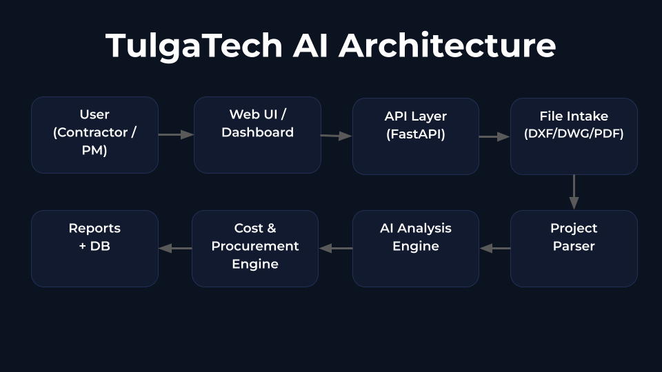

# TulgaTech AI

**TulgaTech AI** is an AI-powered construction project analysis platform designed to help contractors and construction companies automate quantity takeoff, cost estimation, and procurement planning.

The system analyzes DXF, DWG, and PDF project files to provide fast, accurate, and data-driven insights for better decision-making.

---

## System Architecture

---

## Key Features (In Development)

- DXF / DWG / PDF project parsing  
- Automated quantity takeoff  
- Area and volume calculation  
- Cost estimation engine  
- Procurement optimization  
- Financial planning support  

---

## Project Status

**MVP Development**

Active development with pilot users planned.

---

## Target Users

- Contractors  
- Construction companies  
- Project managers  
- Technical offices  

---

## Roadmap

**Phase 1**
- Parser stabilization  
- Core analysis engine  

**Phase 2**
- Cost engine integration  
- Web dashboard  

**Phase 3**
- Pilot deployments  
- Market validation  

---

## Vision

To become a leading AI-powered decision support platform for the construction industry in emerging and global markets.

---

© 2026 Tulga Dijital Sistemler A.Ş. All rights reserved.